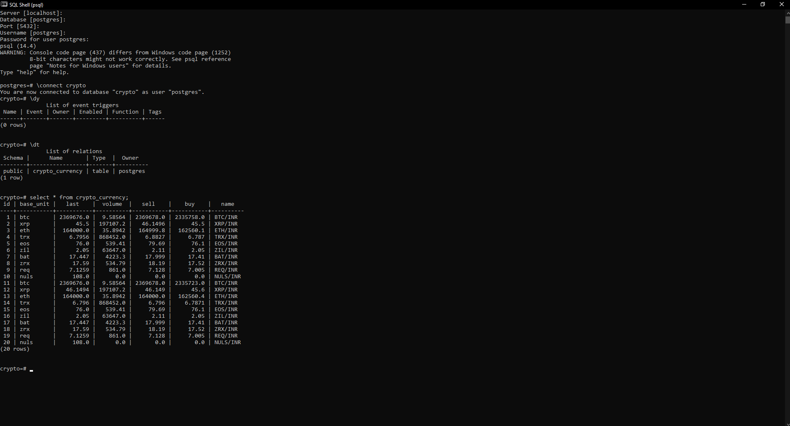
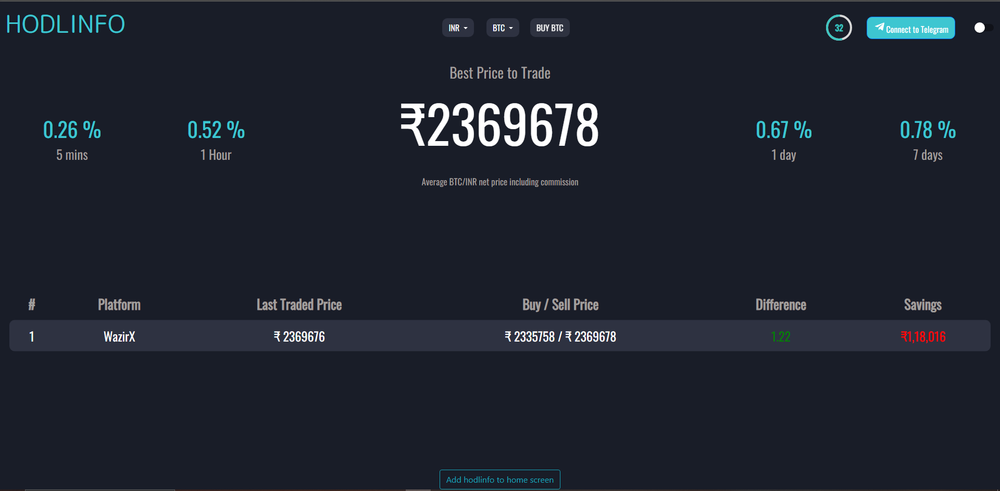
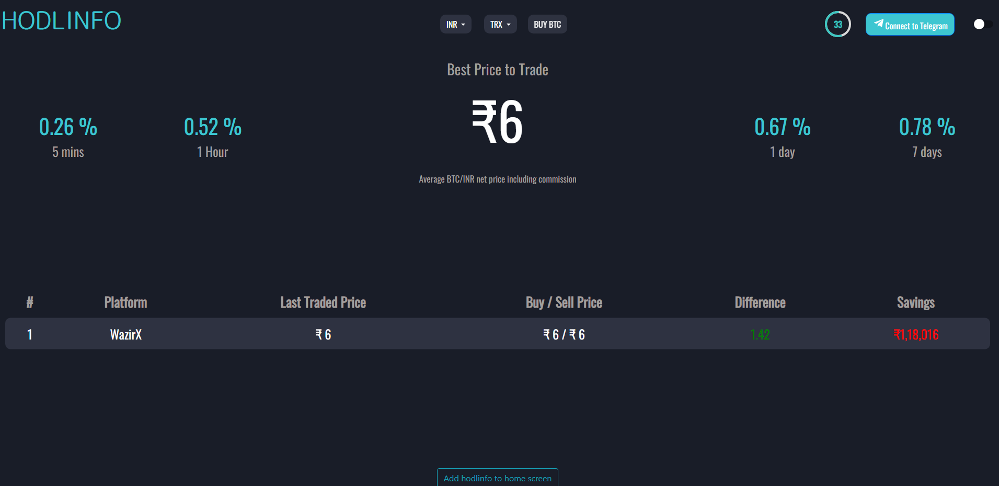

# Hodl Info

Clone of HodlInfo using ReactJS ,NodeJS , PostgreSQL(Sequelize ORM),ExpressJS

## Getting Started

To get started with the Job Portal Backend, follow these steps:
- Clone the repository: git clone https://github.com/HetavShah/hodlinfo 
- Install the dependencies in backend and frontend folder : `npm install`
- Set up the Postgres database and update the database configuration in the .env file.
- Start the server: ` npm start`

